#  AniSend

> **Trust-free livestock escrow for Filipino smallholder farmers.** Lock funds on-chain. Release only when both parties confirm. Built natively on the Soroban blockchain.


---

## 🌪️ The Problem
A smallholder carabao farmer in Nueva Ecija, Philippines lists a ₱45,000 draft animal on Facebook Marketplace but gets scammed by a buyer who sends a fake GCash screenshot — losing both the carabao and the payment, with zero recourse. Traditional escrow services are too expensive, complex, or physically distant for rural farmers to leverage.

## 🛡️ The Soroban Solution
AniSend leverages the **Stellar (Soroban)** blockchain to create a high-performance, transparent escrow marketplace for agricultural trading.
- **On-Chain Custody**: The buyer deposits the exact token amount into the an atomic escrow smart contract.
- **Mutual Confirmation**: Funds are released only after **both** buyer and seller independently confirm the handover.
- **Micro-Fee Economics**: Escrow becomes economically viable even for ₱5k–₱60k livestock transactions with sub-cent fees and ~5-second settlement times.
- **Timelocked Refunds**: Prevents "stuck money". If a deal fails to materialize, the buyer can safely reclaim their funds after a predefined timelock expires.

---

## 🚀 Core Functions & Features
- **The Dashboard**: A real-time hub tracking active deals, total working capital locked in escrow, and transaction history.
- **Deal Listings**: Sellers can create targeted, smart-contract-backed listings defining the animal, price, and designated buyer.
- **Dual-Approval Flow**: Both parties maintain leverage. A buyer inspects the animal and confirms; the seller hands over the animal and confirms. The contract autonomously settles.
- **Hybrid Real-Time Sync**: Convex handles UI indexing and feeds for instant feedback, while the UI directly queries the Soroban RPC to confirm the **authoritative truth** of all escrow states and balances.

---

## 🎬 Demo Flow (2 minutes)

1. Connect Freighter wallet (testnet)
2. Seller creates a deal (buyer address, amount, animal description)
3. Buyer deposits into escrow on-chain
4. Buyer confirms receipt after inspection
5. Seller confirms handoff → escrow auto-releases funds to the seller

Optional paths:
- **Before deposit**: either party can cancel the listing (no funds are locked).
- **After deposit**: only the buyer can cancel **after the timelock expires** to trigger an on-chain refund.

---

## 🏗️ Architecture

```text
Browser (React + Vite)
  |-- Freighter Wallet API      (signing)
  |-- @stellar/stellar-sdk      (transaction building, Soroban RPC)
  |-- Convex                    (real-time off-chain index + activity logs)
  |-- Soroban RPC               (on-chain reads and writes)

Stellar Testnet
  |-- AniSend Soroban Contract  (mutual-confirmation escrow)
  |-- Token Contract            (demo uses XLM via SAC; can be USDC/token contract)
```

No traditional backend server. Deal authority lives on-chain. Convex mirrors key deal metadata for fast UI lists and activity feeds (status is read from chain in the UI).

**On-chain vs off-chain responsibilities**
- **Soroban contract (source of truth)**: custody of funds, deal state machine, authorization checks, timelock refund rules.
- **Frontend (client)**: Freighter connect + signing, contract invoke + RPC reads, renders the current state.
- **Convex (index + activity feed)**: stores deal metadata for listing/history, logs user-visible activity events; the UI still re-checks the chain for the latest status/amount.

---

## 🗂️ Project Structure

```
anisend/
├── Cargo.toml                  # Soroban contract manifest (soroban-sdk 22.0.0)
├── src/
│   ├── lib.rs                  # Soroban escrow contract
│   └── test.rs                 # Unit tests
└── frontend/
    ├── convex/                 # Convex schema, queries, mutations
    │   ├── schema.ts
    │   ├── deals.ts
    │   └── users.ts
    ├── src/
    │   ├── lib/
    │   │   ├── stellar.ts      # Contract calls, Soroban RPC helpers
    │   │   ├── freighter.ts    # Wallet connect + signing
    │   │   └── config.ts       # Environment constants
    │   ├── views/              # Page-level UI
    │   ├── components/         # Shared UI components
    │   ├── types/              # TypeScript interfaces (DealData, etc.)
    │   └── styles/             # Global CSS design system
    └── package.json
```

---

## 🏗️ Stellar Features Used

| Feature | Usage |
| :--- | :--- |
| **Soroban Smart Contracts** | Escrow state machine, mutual release mechanics, and fund custody on-chain. |
| **Soroban Token Interface** | Trustless transfers in/out of escrow. The repo defaults to XLM via SAC, but fully supports USDC. |
| **Contract Timelocks** | Enforces a minimum expiration ledger before a buyer can unilaterally withdraw and cancel a funded deal. |
| **Soroban RPC** | Real-time querying to sync the UI against authoritative on-chain state. |
| **Contract Events** | Emitting structured logs (`deposit`, `c_buyer`, `c_seller`) to build historical tracking. |

---

## 📍 Deployment & Contract Addresses

| Setup Layer | Identifiers |
| :--- | :--- |
| **Marketplace Contract** | `CB5ATT2HG2EDOPWD7D6JQYVR5KQLS5RKIY4GF44HWIF7V6B4PT7FTCFX` |
| **Network Phase** | `Stellar Testnet` |
| **Settlement Token** | `Native XLM` |

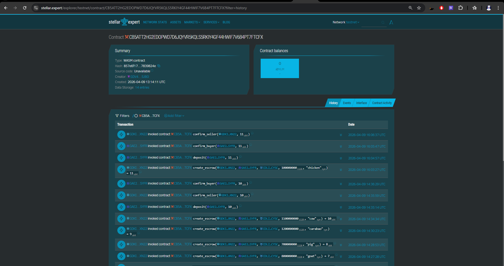

*(Note: Ensure you set `VITE_CONTRACT_ID` in your frontend environment variables to point to this instance.)*

---

## 📜 Smart Contract Interface

AniSend exposes strict mutative logic protecting user assets unconditionally. 

| Function | Caller | Description |
| :--- | :--- | :--- |
| `create_escrow` | **Seller** | Initializes an agreement (buyer, asset, amount). Returns unique `deal_id`. |
| `deposit` | **Buyer** | Executes token transfer from buyer to contract hold. |
| `confirm_buyer` | **Buyer** | Emits a readiness signature. Releases funds if Seller has also confirmed. |
| `confirm_seller`| **Seller** | Emits handover signature. Releases funds if Buyer has also confirmed. |
| `cancel` | **Either** | Dismantles un-funded deals. Reverts funded deals **only** to the Buyer if the timelock limit has expired. |
| `get_escrow` | **Anyone** | Unauthenticated fetch to view raw, definitive escrow struct parameters. |

---

## 🚀 Live Interface Walkthrough

Experience a seamless path to trustless agricultural trading. Check out the flow below:

### 🛡️ 1. Global View & Connect
Starting the DApp and viewing system metrics via an intuitive dashboard.
| Landing Terminal | Main Dashboard |
| :---: | :---: |
| 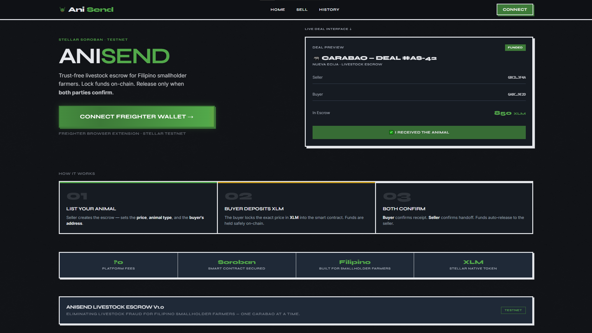 | 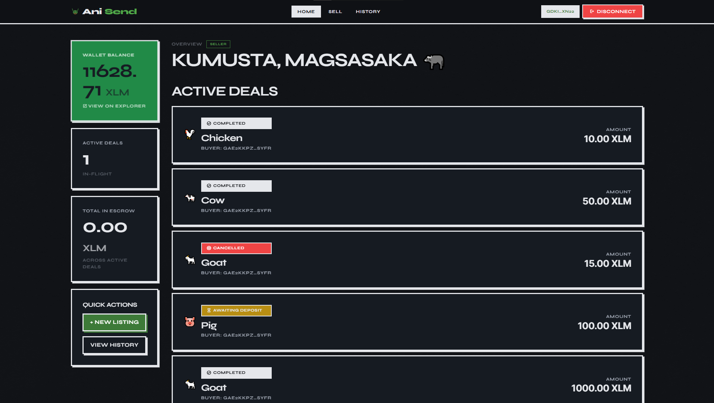 |

### 🌾 2. Creating an Escrow Deal
The seller initiates the transaction, detailing the livestock profile and securing the target buyer's address.
| Initial Listing | Contract Validation |
| :---: | :---: |
| 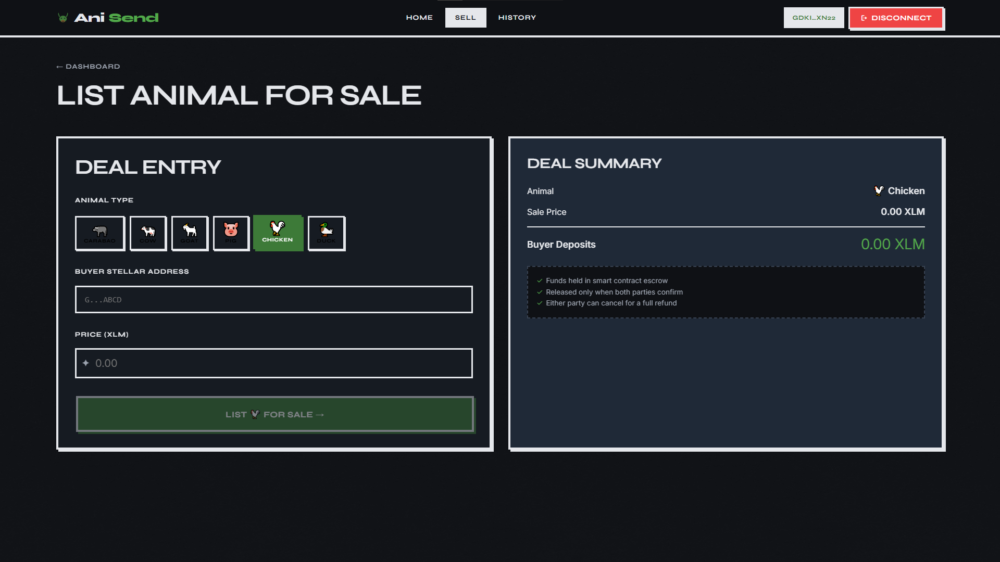 | 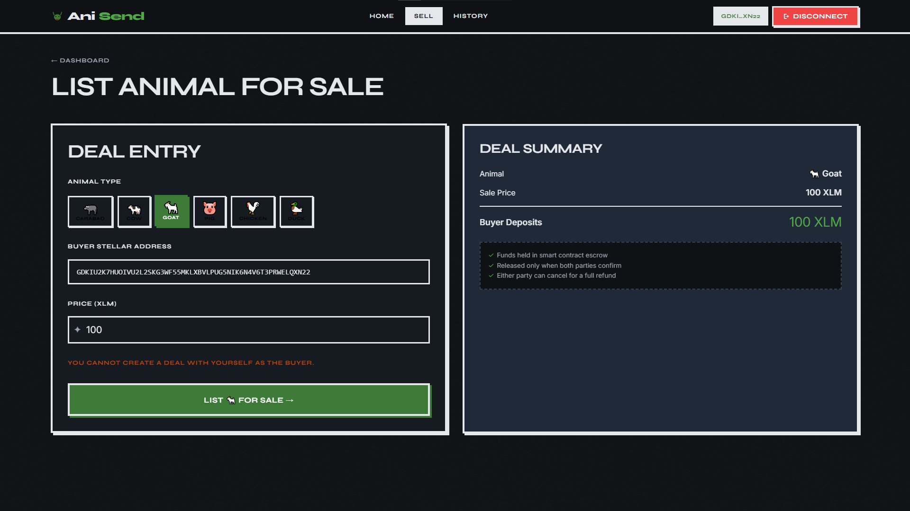 |

### 🔐 3. Buyer Deposit Lifecycle
The buyer reviews the smart contract criteria and escrows their payment on-chain, securing their intent to purchase.
| Buyer Review | Approving Deposit |
| :---: | :---: |
| 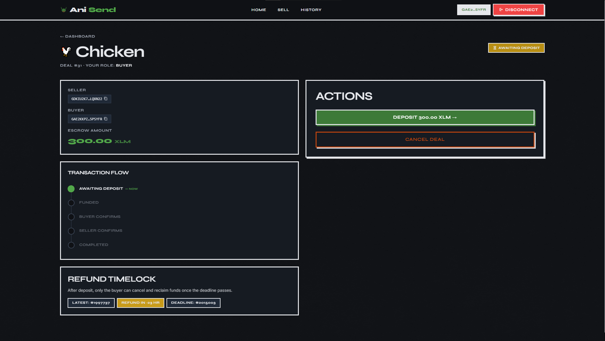 | 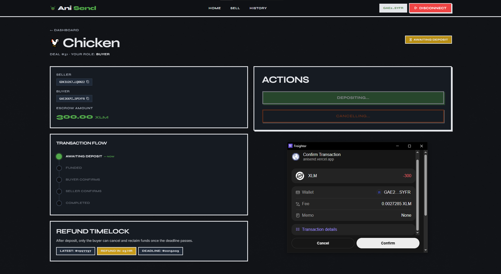 |

### 🤝 4. Mutual Confirmation (The Trustless Handshake)
Both parties must securely cryptograph their approval. When one signs, the state updates. When the second signs, the chain automatically releases the capital.
| Buyer Locks Approval | Seller Receives Notice | Seller Countersigns |
| :---: | :---: | :---: |
| 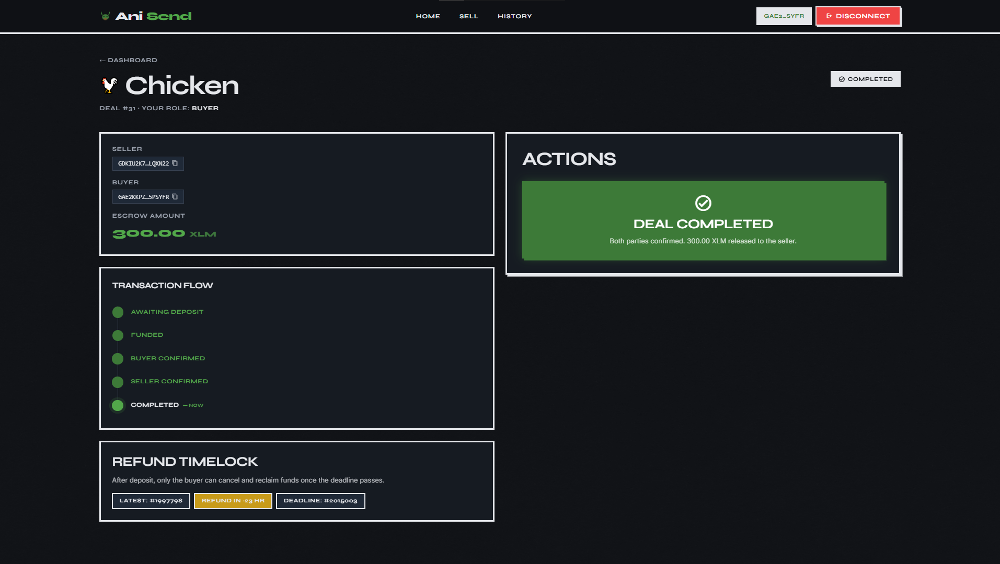 | 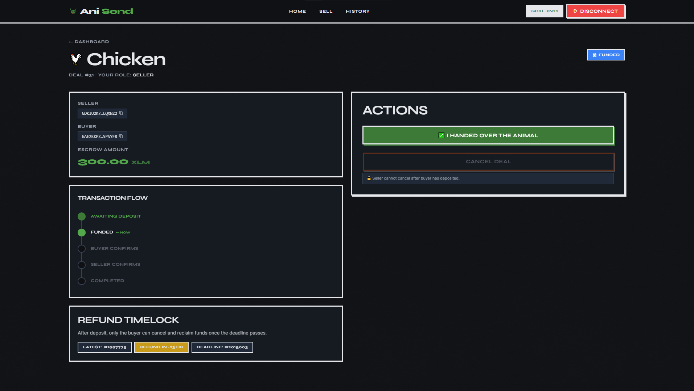 | 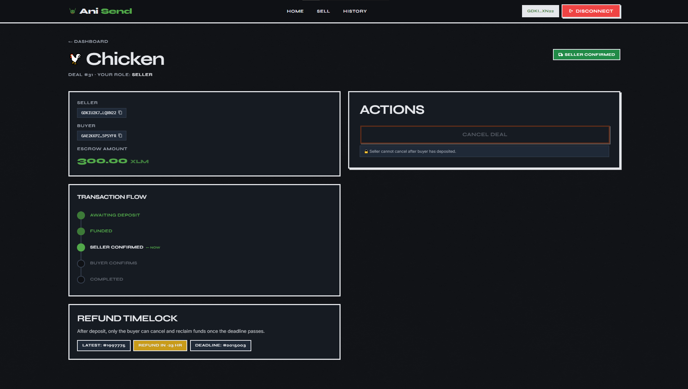 |

### 🏆 5. Fulfillment & History
The contract instantly liquidates, returning absolute trust to the platform, backed by immutable action logs.
| Instant Payout Complete | Immutable Deal History |
| :---: | :---: |
| 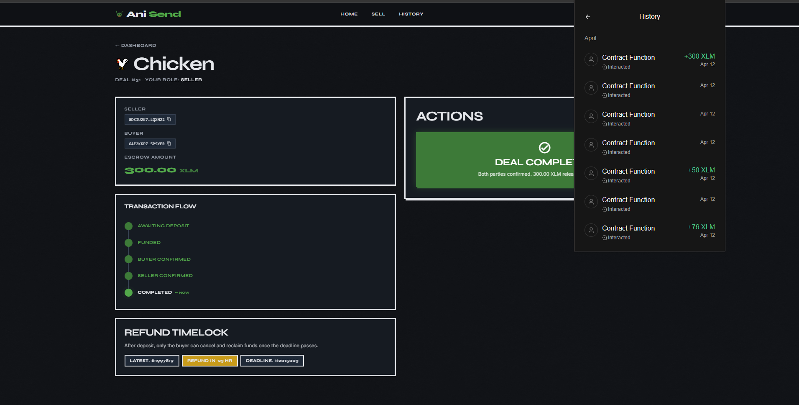 | 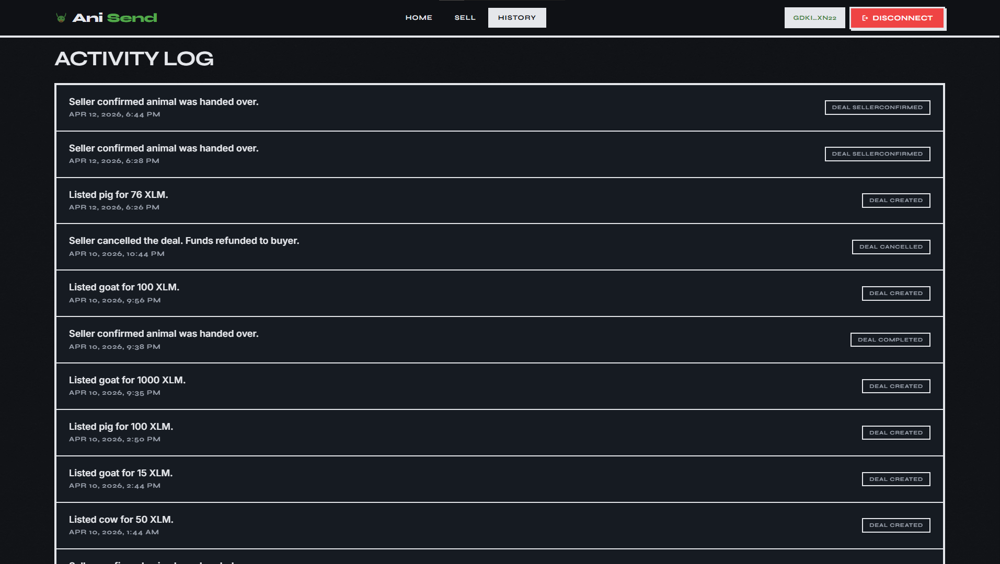 |

---

## 📦 Prerequisites & Local Setup

**For the smart contract:**
- Rust (latest stable)
- Soroban CLI (compatible with `soroban-sdk = 22.0.0`)
- WASM target: `wasm32-unknown-unknown`
- A Stellar testnet account funded via Friendbot

**Frontend Environment:**
- Node.js 18+
- Freighter browser extension (Network: Testnet)
- Convex deployment (for real-time metadata indexing)

### 🖥️ Local Pipeline

1. **Clone & Target Smart Contract (Optional)**:
   ```bash
# Build
   soroban contract build

# Test
   cargo test

# (Optional) Configure Soroban testnet
soroban network add \
  --global testnet \
  --rpc-url https://soroban-testnet.stellar.org:443 \
  --network-passphrase "Test SDF Network ; September 2015"

# Deploy to testnet
soroban keys generate --global deployer --network testnet
soroban keys fund deployer --network testnet
soroban contract deploy \
  --wasm target/wasm32-unknown-unknown/release/anisend.wasm \
  --source deployer \
  --network testnet
   ```

2. **Run The UI**:
   ```bash
   cd frontend
   npm install
   npm run dev
   ```

The app runs at `http://localhost:5173`.

**Environment variables** (`frontend/.env`):

```env
# Required
VITE_CONVEX_URL=https://<your-convex-deployment>.convex.cloud
VITE_CONTRACT_ID=<deployed contract ID>

# Recommended
VITE_NETWORK=testnet
VITE_STELLAR_RPC_URL=https://soroban-testnet.stellar.org

# Token contract used by the demo UI.
# The repo defaults to the Stellar Asset Contract (SAC) for native XLM on testnet.
VITE_XLM_TOKEN_CONTRACT_ID=<token contract id>

# Legacy fallback supported by the code (optional)
VITE_USDC_CONTRACT_ID=<token contract id>
```

### 🧾 Convex (real-time index + logs)

   ```bash
   cd frontend
   npx convex dev
   ```

---

## 🛠️ Sample Execution / CLI Testing

Notes:
- `amount` is in the token’s smallest unit (the demo UI treats amounts as 7-decimal units like XLM).
- Example: 45,000.0000000 units → `450000000000`.

```bash
# Create deal (seller lists a carabao for 45,000 units)
soroban contract invoke \
  --id <CONTRACT_ID> \
  --source <SELLER_KEY> \
  --network testnet \
  -- create_escrow \
  --seller <SELLER_ADDRESS> \
  --buyer <BUYER_ADDRESS> \
  --token <TOKEN_CONTRACT_ID> \
  --amount 450000000000 \
  --description carabao

# Buyer deposits into escrow
soroban contract invoke \
  --id <CONTRACT_ID> \
  --source <BUYER_KEY> \
  --network testnet \
  -- deposit \
  --buyer <BUYER_ADDRESS> \
  --deal_id 0

# Buyer confirms delivery
soroban contract invoke \
  --id <CONTRACT_ID> \
  --source <BUYER_KEY> \
  --network testnet \
  -- confirm_buyer \
  --buyer <BUYER_ADDRESS> \
  --deal_id 0
  
# Seller confirms handoff → funds release
soroban contract invoke \
  --id <CONTRACT_ID> \
  --source <SELLER_KEY> \
  --network testnet \
  -- confirm_seller \
  --seller <SELLER_ADDRESS> \
  --deal_id 0

# Read deal state
soroban contract invoke \
  --id <CONTRACT_ID> \
  --network testnet \
  -- get_escrow \
  --deal_id 0
```

---

## 👥 Target Users & Value

Filipino smallholder farmers and rural livestock traders selling animals via Facebook groups/Marketplace and local auctions who have no buyer protection and are vulnerable to payment fraud. AniSend provides escrow with near-instant settlement and fees low enough to work at ₱5,000–₱60,000 ticket sizes.

---

## 🚀 Why Stellar

Stellar’s fast finality and sub-cent fees make escrow viable for everyday transactions. Soroban contracts let AniSend enforce mutual confirmation and timelocks on-chain, while keeping the UX lightweight via wallet signing (Freighter) and low-friction RPC reads/writes.

---

## 📄 License
MIT — see [LICENSE](LICENSE) for details.
