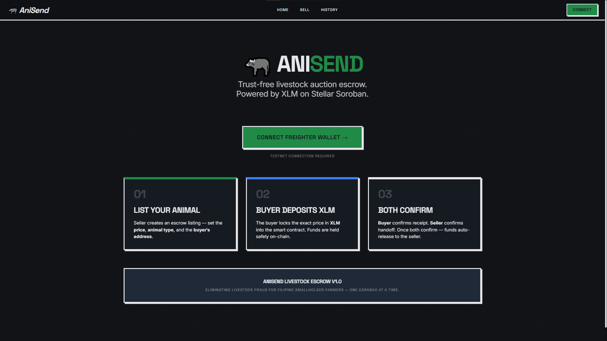

# AniSend

<p align="center">
  
</p>

Livestock auction escrow for Filipino smallholder farmers, built on Stellar.

---

## Problem

A smallholder carabao farmer in Nueva Ecija, Philippines lists a ₱45,000 draft animal on Facebook Marketplace but gets scammed by a buyer who sends a fake GCash screenshot — losing both the carabao and the payment, with zero recourse.

## Solution

AniSend lets a buyer deposit funds into a Soroban smart contract escrow and releases payment only when **both** buyer and seller confirm delivery — making escrow economically viable for ₱5k–₱60k transactions with sub-cent fees and ~5 second settlement.

**What the dApp does (in plain terms):**
- **Locks funds on-chain**: the buyer deposits the exact token amount into the escrow contract.
- **Enforces mutual confirmation**: funds are released only after both buyer and seller confirm.
- **Prevents “stuck money”**: after deposit, the buyer can reclaim funds via a **timelocked refund** if the flow doesn’t complete.
- **Keeps the UI fast**: Convex mirrors deal metadata and logs activity, while the UI reads the authoritative status from chain.

---

## Demo Flow (2 minutes)

1. Connect Freighter wallet (testnet)
2. Seller creates a deal (buyer address, amount, animal description)
3. Buyer deposits into escrow on-chain
4. Buyer confirms receipt after inspection
5. Seller confirms handoff → escrow auto-releases funds to the seller

Optional paths:
- **Before deposit**: either party can cancel the listing (no funds are locked).
- **After deposit**: only the buyer can cancel **after the timelock expires** to trigger an on-chain refund.

---

## Architecture

```
Browser (React + Vite)
  |-- Freighter Wallet API      (signing)
  |-- @stellar/stellar-sdk      (transaction building, Soroban RPC)
  |-- Convex                    (real-time off-chain index + activity logs)
  |-- Soroban RPC               (on-chain reads and writes)

Stellar Testnet
  |-- AniSend Soroban Contract  (mutual-confirmation escrow)
  |-- Token Contract            (demo uses XLM via SAC; can be USDC/token contract)
```

No traditional backend server. Deal authority lives on-chain. Convex mirrors key deal metadata for fast UI lists and activity feeds (status is read from chain in the UI).

**On-chain vs off-chain responsibilities**
- **Soroban contract (source of truth)**: custody of funds, deal state machine, authorization checks, timelock refund rules.
- **Frontend (client)**: Freighter connect + signing, contract invoke + RPC reads, renders the current state.
- **Convex (index + activity feed)**: stores deal metadata for listing/history, logs user-visible activity events; the UI still re-checks the chain for the latest status/amount.

---

## Project Structure

```
anisend/
├── Cargo.toml                  # Soroban contract manifest (soroban-sdk 22.0.0)
├── IDEA.md                     # Full dApp spec
├── src/
│   ├── lib.rs                  # Soroban escrow contract
│   └── test.rs                 # Unit tests
└── frontend/
    ├── convex/                 # Convex schema, queries, mutations
    │   ├── schema.ts
    │   ├── deals.ts
    │   └── users.ts
    ├── src/
    │   ├── lib/
    │   │   ├── stellar.ts      # Contract calls, Soroban RPC helpers
    │   │   ├── freighter.ts    # Wallet connect + signing
    │   │   └── config.ts       # Environment constants
    │   ├── views/              # Page-level UI
    │   ├── components/         # Shared UI components
    │   ├── types/              # TypeScript interfaces (DealData, etc.)
    │   └── styles/             # Global CSS design system
    └── package.json
```

---

## Stellar Features Used

| Feature | Usage |
|---|---|
| Soroban smart contracts | Escrow state machine and fund custody on-chain |
| Soroban token interface | Transfers in/out of escrow (demo uses XLM via SAC; can be USDC) |
| Trustlines (when using USDC) | Participants must hold/trust the token before receiving funds |
| Soroban RPC | Read/write contract state from the UI |
| Events | Contract emits events (`created`, `deposit`, `c_buyer`, `c_seller`, `cancel`) for indexers/UI |

---

## Smart Contract

Deployed on Stellar testnet:

```
<SET_THIS_TO_YOUR_DEPLOYED_CONTRACT_ID>
```

Set your deployed Contract ID in the frontend env (`VITE_CONTRACT_ID`) to point the UI at the correct contract instance.

### Contract Functions

| Function | Caller | Description |
|---|---|---|
| `create_escrow(seller, buyer, token, amount, description)` | Seller | Creates a listing, returns deal ID |
| `deposit(buyer, deal_id)` | Buyer | Transfers token amount into escrow |
| `confirm_buyer(buyer, deal_id)` | Buyer | Marks buyer confirmation; may release funds |
| `confirm_seller(seller, deal_id)` | Seller | Marks seller confirmation; may release funds |
| `cancel(caller, deal_id)` | Buyer or Seller | Cancels; refunds buyer if funded (buyer-only + timelock) |
| `get_escrow(deal_id)` | Anyone | Read-only deal state |

**Key rules enforced by the contract (`src/lib.rs`):**
- **Authorized roles**: only the designated `seller`/`buyer` can act on a deal.
- **Exact-amount deposit**: escrow transfers the deal’s configured `amount` from buyer → contract.
- **Mutual confirmation release**: whichever side confirms second triggers the payout (contract → seller).
- **Cancellation safety**:
  - **AwaitingDeposit**: seller or buyer may cancel freely (nothing to refund).
  - **After deposit**: only the buyer may cancel, and only **after `expires_ledger`** (timelock) to avoid griefing and prevent indefinite lockups.
- **Token-agnostic**: uses Soroban token interface; works with XLM via SAC on testnet or any token contract (e.g., USDC).

### Escrow Status Lifecycle

```
AwaitingDeposit --> Funded --> BuyerConfirmed ----\
                 |         \-> SellerConfirmed ---+--> Completed (funds released)
                 \-------------------------------> Cancelled (refund rules apply)
```

---

## Prerequisites

**For the smart contract:**
- Rust (latest stable)
- Soroban CLI (compatible with `soroban-sdk = 22.0.0`)
- WASM target: `wasm32-unknown-unknown`
- A Stellar testnet account funded via Friendbot

**For the frontend:**
- Node.js 18+
- Freighter browser extension set to Testnet
- A Convex deployment (for indexing/activity logs)

---

## Setup

### Smart Contract

```bash
# Build
soroban contract build

# Test
cargo test

# (Optional) Configure Soroban testnet
soroban network add \
  --global testnet \
  --rpc-url https://soroban-testnet.stellar.org:443 \
  --network-passphrase "Test SDF Network ; September 2015"

# Deploy to testnet
soroban keys generate --global deployer --network testnet
soroban keys fund deployer --network testnet
soroban contract deploy \
  --wasm target/wasm32-unknown-unknown/release/anisend.wasm \
  --source deployer \
  --network testnet
```

### Frontend

```bash
cd frontend
npm install
npm run dev
```

The app runs at `http://localhost:5173`.

**Environment variables** (`frontend/.env`):

```env
# Required
VITE_CONVEX_URL=https://<your-convex-deployment>.convex.cloud
VITE_CONTRACT_ID=<deployed contract ID>

# Recommended
VITE_NETWORK=testnet
VITE_STELLAR_RPC_URL=https://soroban-testnet.stellar.org

# Token contract used by the demo UI.
# The repo defaults to the Stellar Asset Contract (SAC) for native XLM on testnet.
VITE_XLM_TOKEN_CONTRACT_ID=<token contract id>

# Legacy fallback supported by the code (optional)
VITE_USDC_CONTRACT_ID=<token contract id>
```

### Convex (real-time index + logs)

```bash
cd frontend
npx convex dev
```

---

## Sample CLI Invocations

Notes:
- `amount` is in the token’s smallest unit (the demo UI treats amounts as 7-decimal units like XLM).
- Example: 45,000.0000000 units → `450000000000`.

```bash
# Create deal (seller lists a carabao for 45,000 units)
soroban contract invoke \
  --id <CONTRACT_ID> \
  --source <SELLER_KEY> \
  --network testnet \
  -- create_escrow \
  --seller <SELLER_ADDRESS> \
  --buyer <BUYER_ADDRESS> \
  --token <TOKEN_CONTRACT_ID> \
  --amount 450000000000 \
  --description carabao

# Buyer deposits into escrow
soroban contract invoke \
  --id <CONTRACT_ID> \
  --source <BUYER_KEY> \
  --network testnet \
  -- deposit \
  --buyer <BUYER_ADDRESS> \
  --deal_id 0

# Buyer confirms delivery
soroban contract invoke \
  --id <CONTRACT_ID> \
  --source <BUYER_KEY> \
  --network testnet \
  -- confirm_buyer \
  --buyer <BUYER_ADDRESS> \
  --deal_id 0

# Seller confirms handoff → funds release
soroban contract invoke \
  --id <CONTRACT_ID> \
  --source <SELLER_KEY> \
  --network testnet \
  -- confirm_seller \
  --seller <SELLER_ADDRESS> \
  --deal_id 0

# Read deal state
soroban contract invoke \
  --id <CONTRACT_ID> \
  --network testnet \
  -- get_escrow \
  --deal_id 0
```

---

## Target Users

Filipino smallholder farmers and rural livestock traders selling animals via Facebook groups/Marketplace and local auctions who have no buyer protection and are vulnerable to payment fraud. AniSend provides escrow with near-instant settlement and fees low enough to work at ₱5,000–₱60,000 ticket sizes.

---

## Why Stellar

Stellar’s fast finality and sub-cent fees make escrow viable for everyday transactions. Soroban contracts let AniSend enforce mutual confirmation and timelocks on-chain, while keeping the UX lightweight via wallet signing (Freighter) and low-friction RPC reads/writes.

---

## License

MIT — see [LICENSE](LICENSE) for details.
